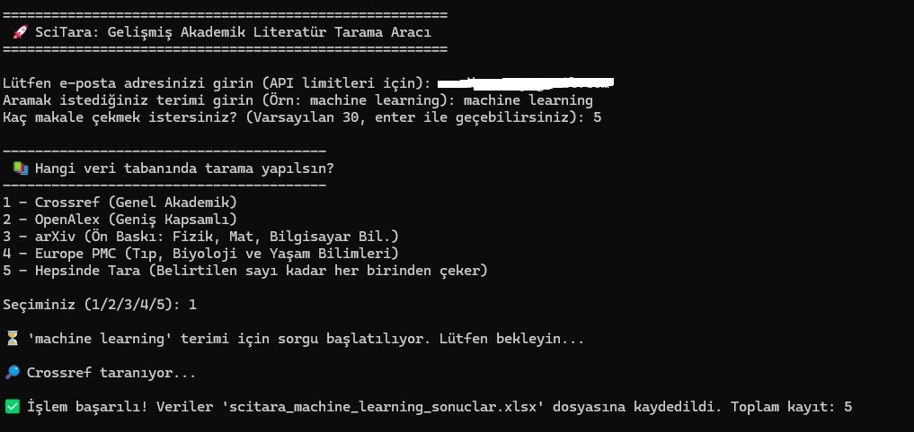

# 📚 SciTara: Açık Kaynaklı Akademik Veri Çekme Aracı

SciTara, akademik araştırma süreçlerini hızlandırmak için geliştirilmiş ücretsiz ve açık kaynaklı bir Python aracıdır.

**OpenAlex**, **Crossref** ve **arXiv** üzerinden saniyeler içinde makale verilerini çeker ve düzenli bir Excel dosyası olarak sunar.

👉 API anahtarı gerekmez
👉 Kurulum basittir
👉 Terminal bilgisi minimum seviyede yeterlidir



---

## ✨ Özellikler

* Çoklu veri kaynağı (OpenAlex, Crossref, arXiv)
* Terminal üzerinden kolay kullanım
* Otomatik dil tespiti (NLP)
* Hata toleranslı veri çekme
* Excel (.xlsx) çıktı

---

## ⚡ Hızlı Başlangıç

### 1. Repoyu indir

```bash
git clone https://github.com/gurkanozsoy/scitara.git
```

### 2. Klasöre gir

```bash
cd scitara
```

### 3. Sanal ortam oluştur

```bash
python3 -m venv venv
```

### 4. Ortamı aktif et (macOS / Linux)

```bash
source venv/bin/activate
```

### 5. Paketleri kur

```bash
python -m pip install -r requirements.txt
```

---

## 🛠️ Kurulum (Detaylı)

### 🍎 macOS

Python kontrol:

```bash
python3 --version
```

Python yoksa:

```bash
brew install python
```

Kurulum:

```bash
git clone https://github.com/gurkanozsoy/scitara.git
cd scitara
python3 -m venv venv
source venv/bin/activate
python -m pip install -r requirements.txt
```

---

### 🐧 Linux (Ubuntu / Debian)

Gerekli paketler:

```bash
sudo apt update
sudo apt install python3 python3-venv python3-pip -y
```

Kurulum:

```bash
git clone https://github.com/gurkanozsoy/scitara.git
cd scitara
python3 -m venv venv
source venv/bin/activate
python -m pip install -r requirements.txt
```

---

### 🪟 Windows

Python kontrol:

```bash
python --version
```

Kurulum:

```bash
git clone https://github.com/gurkanozsoy/scitara.git
cd scitara
python -m venv venv
venv\Scripts\activate
python -m pip install -r requirements.txt
```

---

## 🚀 Kullanım

### Genel makale arama

```bash
python scitara.py
```
---

## ❗ Sorun Giderme

### pip çalışmıyorsa

```bash
python3 -m pip install -r requirements.txt
```

---

### python bulunamadıysa

```bash
python3 scitara.py
```

---

### Sanal ortam aktif değilse

macOS / Linux:

```bash
source venv/bin/activate
```

Windows:

```bash
venv\Scripts\activate
```

---

## 🤝 Katkı

Projeyi fork’layabilir, geliştirebilir ve pull request gönderebilirsin.

---

## ⚠️ Geliştirici Notu

* time.sleep kaldırma
* API’leri agresif kullanma
* HTTP header yapısını bozma

---

## ⭐ Destek

Projeyi beğendiysen yıldız bırak ⭐
